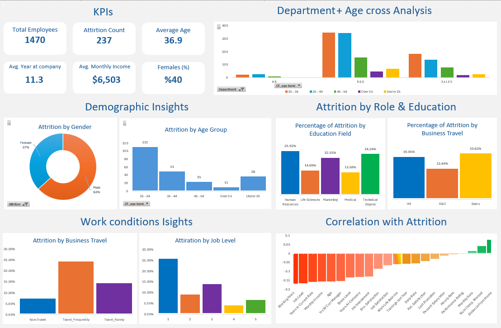
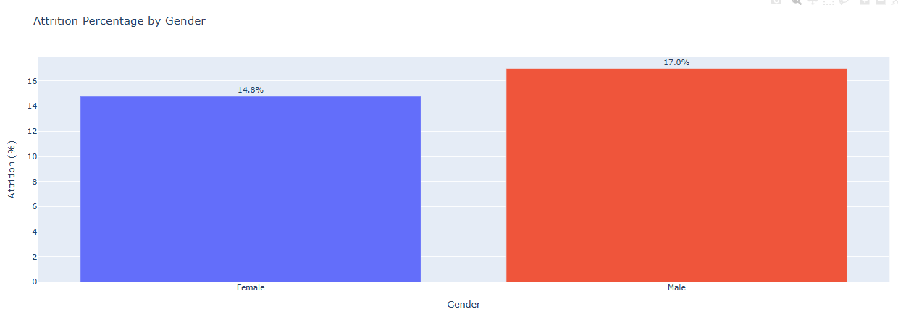
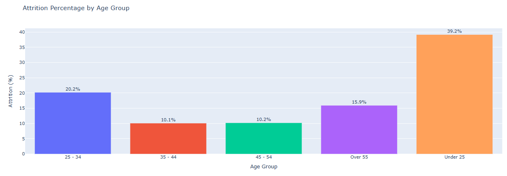
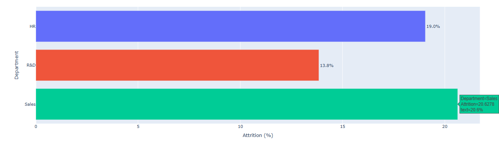
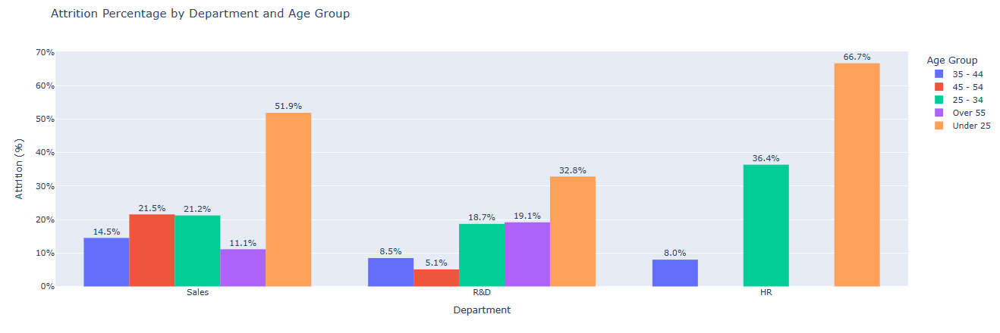
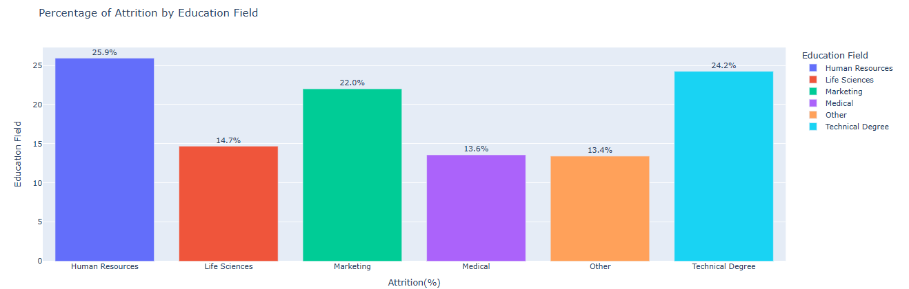
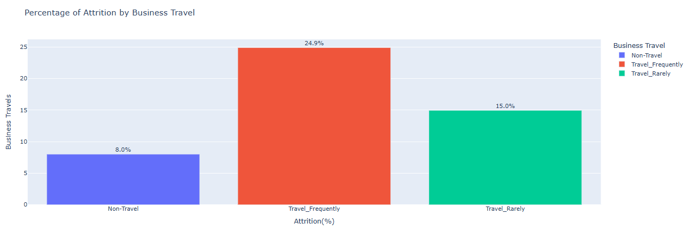
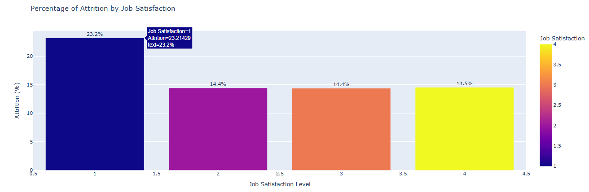
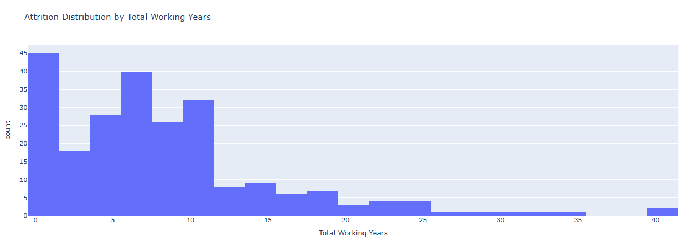
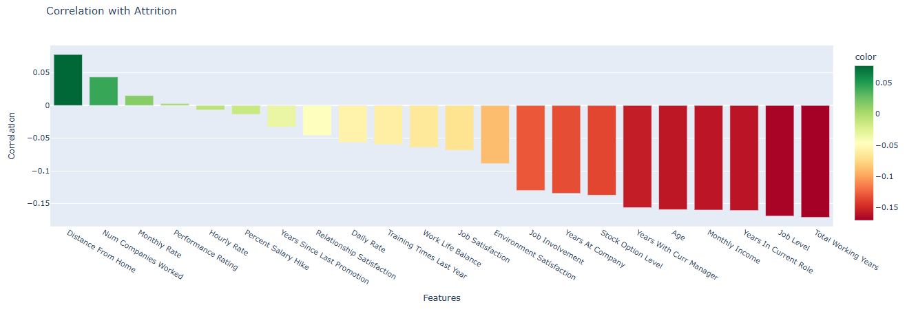

# Employee Attrition Analysis – Data Cleaning, EDA & Dashboard

This project focuses on understanding **why employees leave (attrition)** through data cleaning, analysis, and visualization.
Using **Python** for data preprocessing and **Excel** for dashboard creation, the goal was to extract **actionable HR insights** that help improve employee retention.

## Dashboard Overview  

Here’s the final Excel dashboard summarizing key insights from the HR attrition analysis — including KPIs, demographic breakdowns, education and role analysis, and correlation findings.

## Project Overview

Employee turnover directly impacts productivity, costs, and team stability.
This project explores how **demographics**, **education**, **work conditions**, and **satisfaction metrics** influence attrition.

The final dashboard summarizes the key insights visually — combining clear KPIs with segmented analysis across departments, roles, and work conditions.

##  Data Cleaning & Preparation

The original HR dataset contained redundant columns, constant values, and derived fields that didn’t add analytical value. The cleaning process focused on simplifying the dataset, removing irrelevant information, and preparing it for visualization.

### **Dropped Columns and Reasons**

| Column              | Reason                                       |
| ------------------- | -------------------------------------------- |
| emp no              | Just an employee ID, doesn’t affect analysis |
| Employee Number     | Same as above, used only for identification  |
| Employee Count      | Always has the same value                    |
| Over18              | Everyone is over 18, not useful              |
| Standard Hours      | Same value for all employees                 |
| CF_attrition count  | Calculated value, not an employee feature    |
| CF_attrition counts | Too many missing values                      |
| CF_attrition rate   | Derived metric, not relevant                 |
| CF_current Employee | Duplicates the Attrition column              |
| CF_attrition label  | Duplicate of Attrition                       |
| -2 / 0              | Useless or unclear data columns              |

After dropping these, the dataset became cleaner and easier to interpret.

### **Transformations**

* Converted **`Attrition`** column into binary (Yes = 1, No = 0).
* Created **age groups** to analyze turnover by career stage.
* Standardized categorical names and verified numeric data types.

## Key KPIs from the Clean Dataset

| Metric                       | Value      |
| ---------------------------- | ---------- |
| **Total Employees**          | 1,470      |
| **Attrition Count**          | 237        |
| **Attrition Rate**           | 16.1%      |
| **Average Age**              | 36.9 years |
| **Average Years at Company** | 11.3       |
| **Average Monthly Income**   | $6,503     |
| **Female Employees**         | 40%        |

## Exploratory Analysis & Insights

### **Demographic Insights**

* **Gender:** Male employees show slightly higher attrition (≈17%) compared to females (≈14.8%).
  → Men tend to leave the company more frequently than women.
  

* **Age Group:** The **highest attrition** is among employees **under 25 (≈39%)**, followed by **25–34 (≈20%)**.
  Attrition **drops sharply after 35**, indicating that early-career employees are more likely to leave.

  
---

### **Department Analysis**

* **Sales (≈20.6%)** and **HR (≈19%)** have the **highest attrition**.
* **R&D (≈13.8%)** shows stronger retention.
  → Suggests that Sales and HR roles may face more stress, fewer growth opportunities, or job-hopping tendencies.

  

---

### **Department × Age Analysis**

* **Younger employees (< 25)** have the **highest attrition rates** across all departments — especially
  **HR (≈66.7%)** and **Sales (≈51.9%)**.
* Employees **aged 35–44 and 45–54** show much lower attrition levels (< 22%).
  → Indicates that younger staff in HR and Sales are more likely to leave early due to limited experience or faster career ambitions.

  
---

### **Education Field**

* Highest attrition in **Human Resources (25.9%)**, **Technical Degrees (24.2%)**, and **Marketing (22%)**.
* Lowest attrition in **Medical (13.6%)** and **Life Sciences (14.7%)**.
  → Employees in HR, technical, and marketing roles may face heavier workloads or more external opportunities.

  
---

### **Work Conditions**

* **Frequent travelers (≈24.9%)** have almost **3× higher attrition** than **non-travelers (≈8%)**.
  → Frequent travel likely contributes to stress or work-life imbalance.

    

---

### **Job Satisfaction**

* Employees with **low satisfaction (Level 1)** show the **highest attrition (≈23%)**.
* Levels 2–4 remain steady (≈14–15%).
  → Very low satisfaction is a clear driver of turnover, while moderate–high satisfaction stabilizes retention.
      
---

### **Experience (Total Working Years)**

* Employees with **< 10 years of total experience** have the **highest attrition**, especially in the early career stage (0–5 years).
* Attrition **drops significantly after 10 years**, staying low beyond 15 years.
  → Less experienced employees are more likely to leave for career growth or better pay, while senior employees stay longer.
      
---

### **Correlation with Attrition**

| Feature                 | Correlation | Interpretation                             |
| ----------------------- | ----------- | ------------------------------------------ |
| `Total Working Years`   | −0.171      | More experience → lower attrition          |
| `Job Level`             | −0.169      | Higher seniority → more stability          |
| `Years in Current Role` | −0.166      | Staying longer in a role → less turnover   |
| `Monthly Income`        | −0.160      | Higher income → higher retention           |
| `Age`                   | −0.156      | Older employees → lower attrition          |
| `Distance From Home`    | +0.078      | Longer commute → slightly higher attrition |

**Negative correlation** → improves retention
**Positive correlation** → associated with higher attrition

→ Experience, income, and tenure are the strongest stabilizing factors, while distance and frequent travel mildly increase risk.
         

---

## Dashboard Overview

The Excel dashboard summarizes all findings visually:

| Section                             | Description                                 |
| ----------------------------------- | ------------------------------------------- |
| **KPIs**                            | Overall employee and attrition metrics      |
| **Department + Age Cross Analysis** | Combined impact of department and age       |
| **Demographic Insights**            | Gender and age-based attrition              |
| **Attrition by Role & Education**   | Comparison across education and departments |
| **Work Conditions Insights**        | Travel frequency and job level patterns     |
| **Correlation with Attrition**      | Factors most related to employee retention  |

---

##  Final Insights & Conclusion

Employee attrition is primarily driven by **youth, inexperience, low satisfaction, and demanding work conditions**.
**Younger and early-career employees** are the most likely to leave, especially those facing **frequent travel**, **low job satisfaction**, or **entry-level positions**.

In contrast, **higher income**, **career progression**, and **longer tenure** are strong indicators of retention.

To reduce turnover and improve employee engagement, organizations should focus on:

* **Early-career development** and mentorship programs
* **Clear progression paths** and internal mobility
* **Work-life balance** to reduce burnout
* **Competitive pay and recognition** for performance

→ Strengthening these areas can significantly improve retention, satisfaction, and long-term workforce stability.

---

##  Author

**Adham Nassar**

 Applied Artificial Intelligence (B.Sc.) – TH Rosenheim

