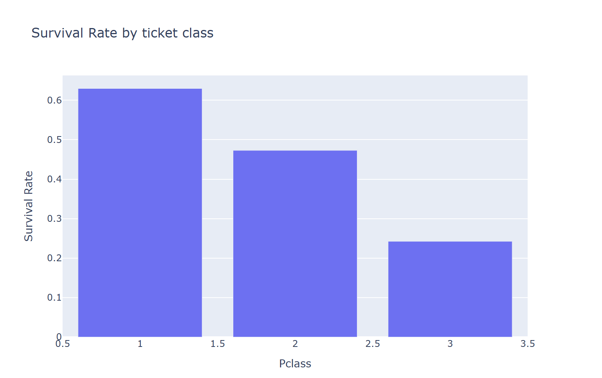
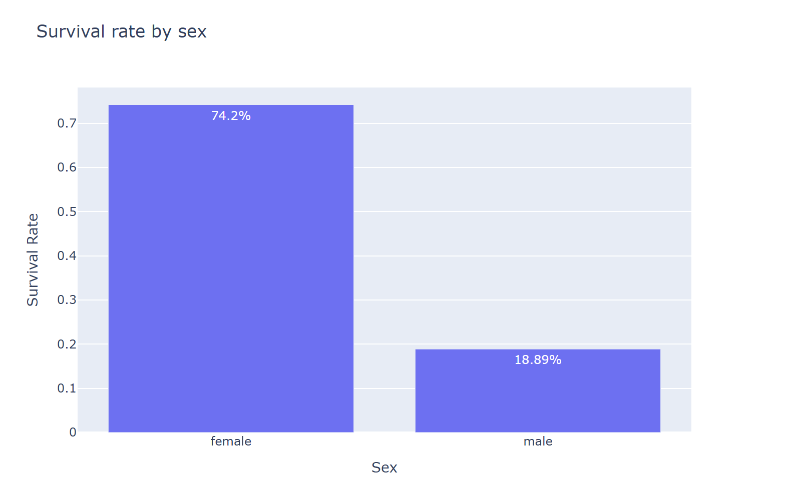
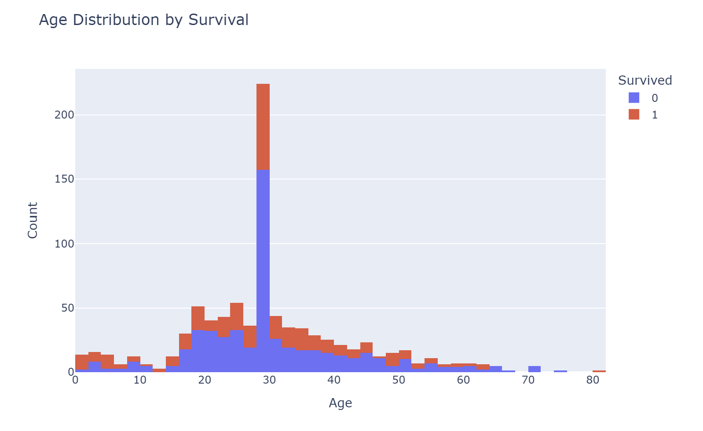
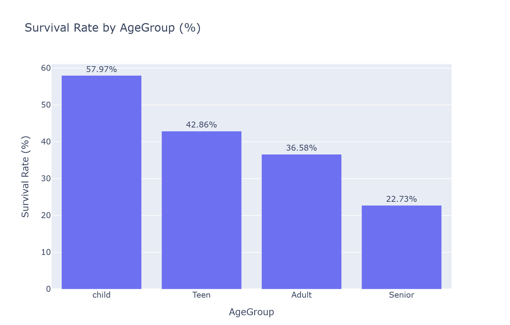
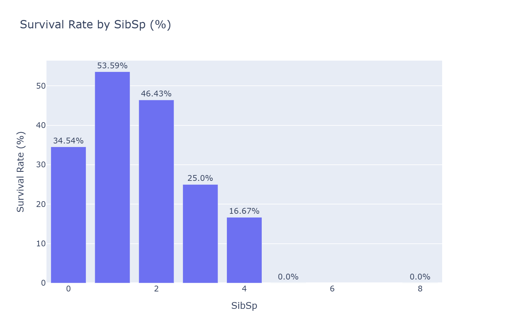
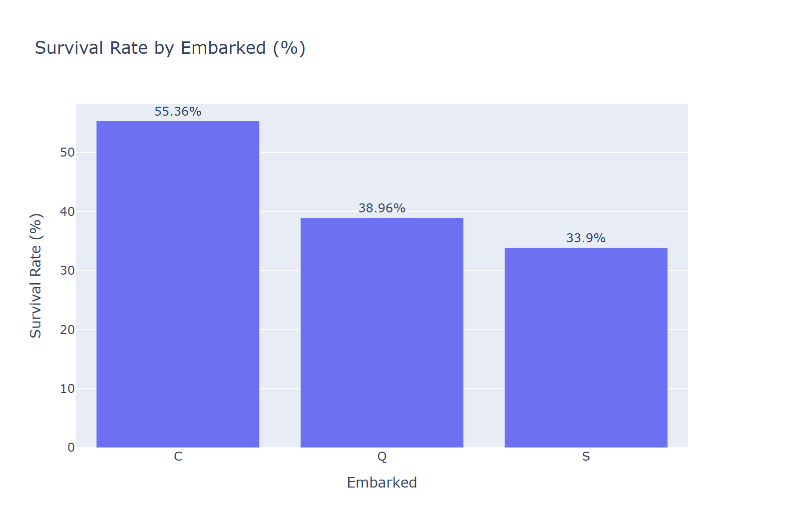

##  Exploratory Data Analysis on the Titanic Dataset

This project performs a complete **Exploratory Data Analysis (EDA)** on the classic **Titanic dataset**, focusing on discovering the key factors that influenced passenger survival.  

---

##  Main Objectives
- Clean and prepare the dataset for analysis.  
- Understand survival distribution across different passenger characteristics.  
- Visualize relationships between features and survival outcomes.  
- Generate actionable insights based on data patterns.  

---

##  Data Cleaning
- Handled missing values in key columns (`Age`, `Embarked`, `Cabin`, etc.).  
- Converted categorical data into readable formats.  
- Checked data consistency and structure before visualization.  

---

##  Key Insights

- **Passenger Class (Pclass):**  
  Survival probability strongly decreased with lower class.  
  - First-class passengers had the highest survival rates due to proximity to lifeboats and better access.  
  - Third-class passengers, mostly located on the lower decks, faced the highest fatality rates.

    
         *Figure: Survival Rate by Passenger Class.*

- **Gender (Sex):**  
  Gender was one of the strongest predictors of survival.  
  - Around 75% of females survived compared to roughly 20% of males.  
  - This reflects the “women and children first” evacuation policy followed during the disaster.

    
         *Figure: Survival Rate by Gender.*

- **Age:**  
  - Younger passengers—especially children under 10—had higher survival rates.  
  - Elderly passengers (above 50) faced much lower chances of survival, possibly due to physical limitations during evacuation.

  
     *Figure: Age Distribution by Survival.*
  
    *Figure: Survival Rate by Age Group.*

- **Family Size:**  
  - Passengers traveling with small families (2–4 members) had better survival odds.  
  - Those alone or in large groups (>5 members) were less likely to survive, possibly due to difficulties in coordination and rescue.

    
         *Figure: Survival Rate by Family Size.*

- **Embarkation Port (Embarked):**  
  - Passengers who boarded from Cherbourg (C) showed slightly better survival rates, likely linked to a higher proportion of first-class travelers.

    
         *Figure: Survival Rate by Embarkation Port.*

- **Overall Pattern:**  
  The data shows a strong link between **socioeconomic status, gender, and survival outcomes**.  
  Higher class, female gender, and moderate family size consistently improved survival odds, demonstrating both **social structure and resource accessibility** as critical survival factors.

---

##  Tools Used
- **Python** (Pandas, NumPy)
- **Visualization:** Matplotlib, Seaborn
- **Jupyter Notebook** for interactive exploration

---

##  Dataset & Notebook
- Dataset: [Kaggle – Titanic: Machine Learning from Disaster](https://www.kaggle.com/c/titanic)  
- Notebook: [Exploratory Data Analysis on the Titanic Dataset](https://www.kaggle.com/code/adham1nassar/exploratory-data-analysis-on-the-titanic-dataset)

---

###  Author
**Adham Nassar**  
[LinkedIn](https://www.linkedin.com/in/adham-nassar-83ba54347)  
Part of the *Data Analysis Portfolio* — showcasing data cleaning, EDA, and visualization skills.

