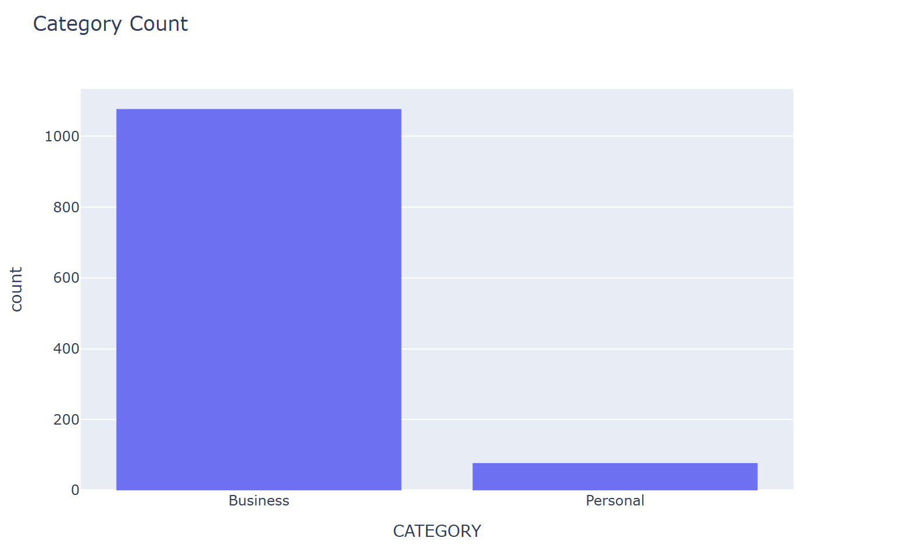
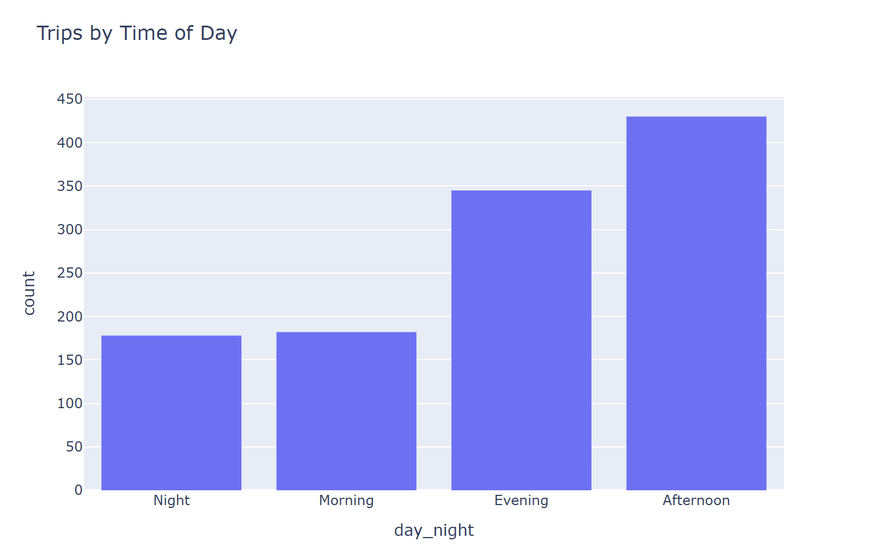
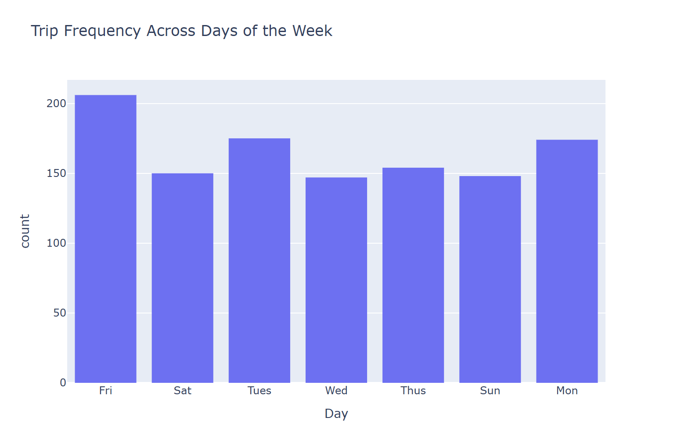
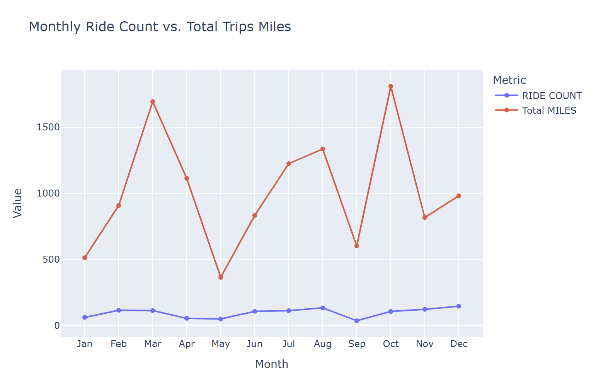

# Exploratory Data Analysis on Uber Trip Data

This project explores **Uber trip data** to uncover demand patterns, usage behavior, and time-based trends across different hours, days, and months. The goal is to transform raw ride data into clear insights about user activity and ride distribution over time.

---

## Main Objectives
- Clean and structure the dataset for analysis.  
- Analyze trip frequency over time and across categories.  
- Identify patterns in ride demand by hour, day, and month.  
- Visualize trends and summarize behavioral insights.  

---

## Data Cleaning
- Checked for missing and inconsistent values across all columns.  
- Standardized datetime format and extracted useful time features (`hour`, `day`, `month`).  
- Created a **`day_night`** column to categorize rides into four distinct time intervals:  
  *Morning (0:00–10:00), Afternoon (10:00–15:00), Evening (15:00–19:00), Night (19:00–00:00).*  
- Created a **`MONTH`** column and mapped numeric values to **month labels (Jan–Dec)** to analyze **monthly ride counts and total miles** in a summarized view.
- Removed invalid or duplicate entries to ensure accurate analysis.  
- Verified data types for proper aggregation and plotting.  

---

## Key Insights

- **Purpose Analysis:**  
  - The majority of Uber trips are categorized as **Business**, making up the **dominant share** of total rides.  
  - **Personal rides** represent a much smaller proportion, indicating that the dataset primarily reflects **work-related travel behavior**.  
  - This highlights Uber’s significant role as a **business mobility solution**, especially for commuting, meetings, and corporate transport.

    
         *Figure: Purpose Analysis.*

- **Time of Day Patterns:**

  * **Afternoon (10:00–15:00)** shows the **highest demand**, representing the busiest travel period of the day.
  * **Evening (15:00–19:00)** follows as the **second peak**, likely reflecting after-work or social travel.
  * **Morning (0:00–10:00)** maintains a **moderate activity level**, mostly early commutes.
  * **Night (19:00–00:00)** has the **lowest number of trips**, indicating reduced late-night movement.

    
         *Figure: Time of Day Patterns.*

- **Day of Week Trends:**  
  - **Friday** records the **highest trip volume**, followed by **Monday and Tuesday**.  
  - **Thursday** maintains mid-range activity, while **Wednesday and Sunday** have the **lowest counts**.  
  - This pattern suggests that business-related travel peaks toward the end of the workweek.

    
         *Figure: Day of Week Trends.*

- **Monthly and Seasonal Trends:**  
  - **December, August, and November** had the **highest ride volumes**, showing strong demand during late-year and summer months.  
  - **October** and **March** saw the **highest total miles**, reflecting longer average travel distances.  
  - **May and September** showed the **lowest activity**, both in ride count and total distance.  
  - Overall, travel tends to peak in **summer and late-year months**, driven by holidays and increased business mobility.

    
         *Figure: Monthly and Seasonal Trends.*

- **Summary of Insights**

  * Most trips were **business-related**, highlighting Uber’s corporate use.
  * **Afternoon and evening** hours saw the **highest demand**, while **night** had the lowest.
  * **Friday** was the busiest day; **Sunday and Wednesday** were the quietest.
  * **December, August, and November** had peak rides, with **October and March** leading in trip distance.
  * Overall, Uber usage peaks during **work hours and late-year months**, reflecting strong business and commuter travel patterns.

---

## Tools Used
- **Python** (Pandas, NumPy)
- **Visualization:** Matplotlib, Seaborn, Plotly
- **Jupyter Notebook** for data exploration and chart creation

---

## Dataset & Notebook
- Dataset: [Uber Trip Data](https://raw.githubusercontent.com/EshitaNandy/Uber-Trip-Analysis/master/My%20Uber%20Drives%20-%202016.csv) *(Dataset accessed via GitHub repository)*  
- Notebook: [Exploratory Data Analysis on Uber Trip Data](https://www.kaggle.com/code/adham1nassar/exploratory-data-analysis-on-uber-trip-data)

---

### Author
**Adham Nassar**  
[LinkedIn](https://www.linkedin.com/in/adham-nassar-83ba54347)  
Part of the *Data Analysis Portfolio* — showcasing skills in time-series EDA, feature engineering, and visualization.

