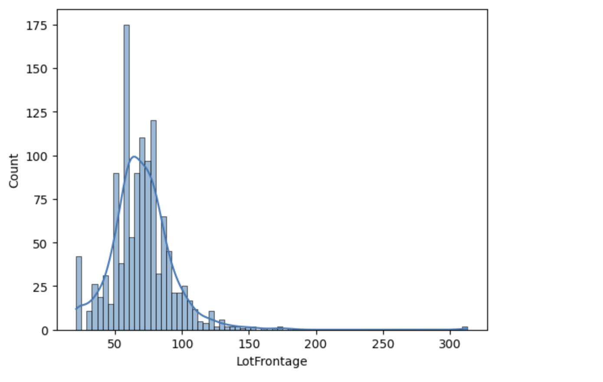
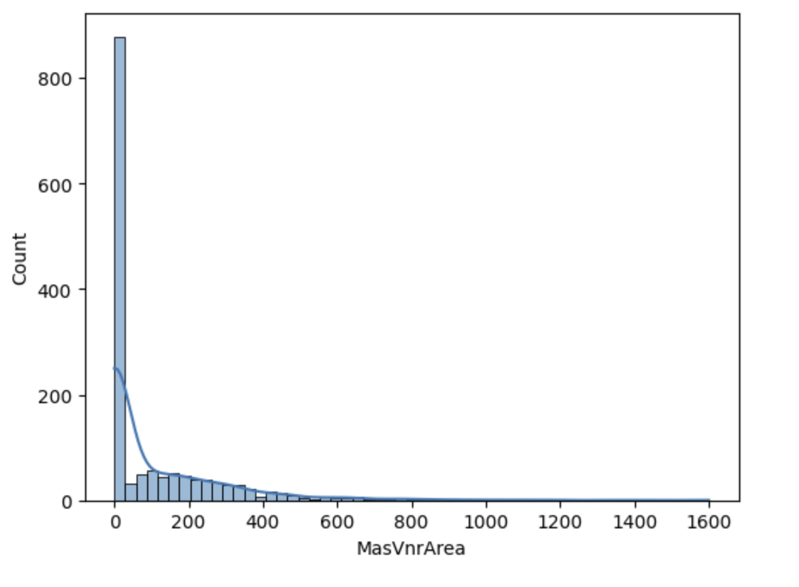
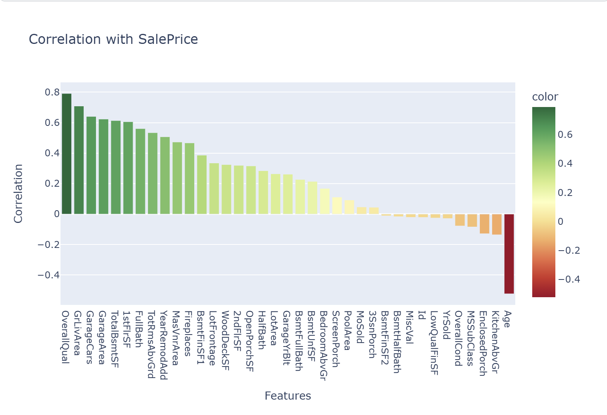

# House Prices — Data Cleaning and Analysis

This notebook focuses on **deep data understanding, structured cleaning, and intelligent feature engineering** using the House Prices dataset.  
The main goal was not simply to fill missing values but to **analyze the logical relationships between features** and apply **context-aware cleaning** that preserves the dataset’s integrity.

---

## Project Objectives
- Conduct a **relationship-driven data cleaning** process by understanding how features interact.  
- Apply **domain-informed imputations** instead of generic statistical replacements.  
- Create new features that improve interpretability and modeling.  
- Visualize feature distributions and analyze correlations with the **SalePrice** variable.

---

## Data Cleaning Approach

The cleaning stage was guided by the **logical relationships** between related columns and **dataset semantics**.  
Rather than using mean or mode for all missing values, each feature was examined individually using insights from the **Dataset Description** and internal dependencies.

### Fireplace Features
- The `FireplaceQu` (Fireplace Quality) column was analyzed alongside `Fireplaces` (Number of Fireplaces).  
- **Insight:** All `NaN` values in `FireplaceQu` occurred where the number of fireplaces was `0`, meaning there was no fireplace at all.  
- These missing values were replaced with **“Zero”** to indicate absence rather than poor data quality.

### Garage-Related Columns
- Several columns — `GarageType`, `GarageYrBlt`, `GarageFinish`, `GarageQual`, `GarageCond`, etc. — shared **identical missing-value percentages**, revealing a **linked dependency**.  
- **Insight:** Missing entries corresponded to houses **without a garage**.  
- Applied a hybrid filling approach:
  - Text-based features (e.g., `GarageType`, `GarageFinish`) were replaced with **“NF” (No Feature)**.  
  - Numerical ones (e.g., `GarageYrBlt`, `GarageCars`, `GarageArea`) were replaced with **0**.

### Basement Features
- A similar dependency was found across basement-related columns such as `BsmtQual`, `BsmtCond`, `BsmtExposure`, and `BsmtFinType1/2`.  
- **Insight:** Missing values indicated that the house **lacked a basement**, not random data loss.  
- These were logically imputed with **“NF” or 0** depending on type.  
- The `BsmtExposure` column had a unique pattern: missing entries appeared even when other basement fields were filled.  
  - This column was **independently filled using its mode**, since its data type was categorical (`object`).

This systematic approach created a **clean, interpretable dataset** where every imputed value carried semantic meaning.

---

## Feature Engineering
- A new **`Age`** feature was engineered from `YearBuilt` to better represent house age.  
- Standardized inconsistent categorical labels and adjusted data types for visualization.  
- These transformations improved dataset consistency and made relationships easier to analyze.

---

## Visual Exploration
Several plots were created to explore data distributions and relationships:

- **Distributions:**  
  - `LotFrontage` showed a slightly right-skewed distribution — handled contextually during imputation. 

       
            *Figure: LotFrontage Distributions.*

  - `MasVnrArea` revealed that most homes had little to no masonry veneer.  

        
              *Figure: MasVnrArea Distributions.*

- **Correlation Analysis:**  
  - A heatmap and bar plot were used to visualize **correlation with `SalePrice`**.  
  - Key positive correlations included `OverallQual`, `GrLivArea`, `GarageCars`, and `TotalBsmtSF`.  
  - Negative correlations were found in `KitchenAbvGr` and the engineered `Age` feature.  

        
              *Figure: Correlation with SalePrice.*

These insights help identify which physical and qualitative aspects most influence property value.

---

## Tools Used
- **Python**: pandas, numpy  
- **Visualization**: seaborn, plotly, matplotlib  
- **Environment**: Jupyter Notebook  

---

## Dataset & Notebook
- Dataset: [Kaggle – House Prices: Advanced Regression Techniques](https://www.kaggle.com/c/house-prices-advanced-regression-techniques)  
- Notebook: [House Prices – Cleaning and Analysis](https://www.kaggle.com/code/adham1nassar/house-prices-cleaning-and-analysis)

---

### Author
**Adham Nassar**  
[LinkedIn](https://www.linkedin.com/in/adham-nassar-83ba54347)  
This project demonstrates strong focus on **logical data cleaning, feature interpretation**, and **data-driven decision making** for model-ready datasets.
